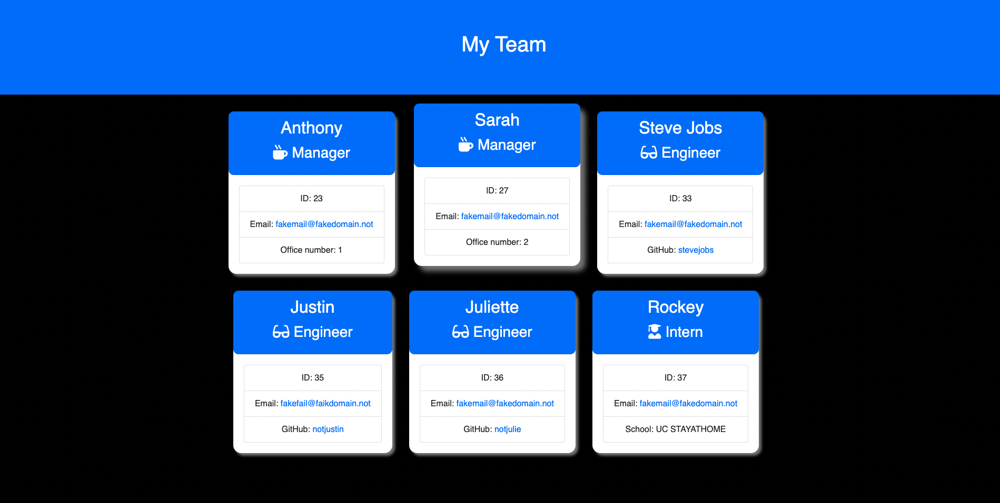

# OOPteamprofiler

This script is a command-line interface (CLI) tool that generates an HTML page displaying a software development team's information. It uses inquirer to prompt users to add employees to the team, with the type of employee (`Manager`, `Engineer`, or `Intern`) selected by the user. The employee data entered is then used to create objects of `Manager`, `Engineer`, or `Intern` classes (which are required from separate files), and these objects are added to an array 'team'. Once the user is done adding employees, the `buildHTML` function is called to generate the HTML file by writing the output of the `generateTeam` function to the file system. The `generateTeam` function uses the 'team' array data to create the HTML output.

## User Story

```md
AS A manager
I WANT to generate a webpage that displays my team's basic info
SO THAT I have quick access to their emails and GitHub profiles
```

## Acceptance Criteria

```md
GIVEN a command-line application that accepts user input
WHEN I am prompted for my team members and their information
THEN an HTML file is generated that displays a nicely formatted team roster based on user input
WHEN I click on an email address in the HTML
THEN my default email program opens and populates the TO field of the email with the address
WHEN I click on the GitHub username
THEN that GitHub profile opens in a new tab
WHEN I start the application
THEN I am prompted to enter the team manager’s name, employee ID, email address, and office number
WHEN I enter the team manager’s name, employee ID, email address, and office number
THEN I am presented with a menu with the option to add an engineer or an intern or to finish building my team
WHEN I select the engineer option
THEN I am prompted to enter the engineer’s name, ID, email, and GitHub username, and I am taken back to the menu
WHEN I select the intern option
THEN I am prompted to enter the intern’s name, ID, email, and school, and I am taken back to the menu
WHEN I decide to finish building my team
THEN I exit the application, and the HTML is generated
```

## Installation

To generate your own team, `git clone` the repo down to your local so you have the Node project on your local.

Run `npm i` in order to install the following npm package dependencies as specified in the `package.json`:

- [`inquirer`](https://www.npmjs.com/package/inquirer) will prompt you for your inputs from the command line.
- [`jest`](https://www.npmjs.com/package/jest) will help you run tests with ease.

The application will start by running `node index.js` in the command line.

Answer the prompts in your command line to build your team.

After answering all the prompts, your 'team.html' file will be ready for you to load.

The HTML file will yours to keep and deploy how you see fit.



## Video Walkthrough

https://user-images.githubusercontent.com/113067058/216005485-c83d2bec-c6c2-4d6f-b418-83cbfbedff6d.mov

## Code Snippets

### Switch Case

The createTeam function is used to add employees to a team. It uses the inquirer module to prompt the user with a list of employee types to choose from, including `Manager`, `Engineer`, `Intern`, and `Finish`. Depending on the user's selection, the corresponding function (`addManager`, `addEngineer`, `addIntern`) is called to add the employee. If the user selects `Finish`, the `buildHTML` function is called to create the HTML file containing information about the team.

```js
function createTeam() {
  inquirer
    .prompt([
      {
        type: "list",
        message: "What type of employee are you adding to the team?",
        name: "addEmployeePrompt",
        choices: ["Manager", "Engineer", "Intern", "Finish"],
      },
    ])
    .then(function (userInput) {
      switch (userInput.addEmployeePrompt) {
        case "Manager":
          addManager();
          break;
        case "Engineer":
          addEngineer();
          break;
        case "Intern":
          addIntern();
          break;
        case "Finish":
          buildHTML();
          return;
        default:
          return;
      }
    });
}
```

### How To Write a File Using fs Module

Add the `fs` module by typing `npm i fs` in your command line.

Add the module to your script so that it can be read.

```js
const fs = require("fs");
```

The `buildHTML` function is used to create an HTML file containing information about a team. It uses the `fs` (File System) module to write the contents of the file, which is generated by the generateTeam function and passed as an argument. The file is written to the location specified by the outputPath variable and encoded in UTF-8 format. If the file creation is successful, a message "team Created!" is logged to the console.

```js
function buildHTML() {
  fs.writeFileSync(outputPath, generateTeam(team), "utf-8");
  console.log("team Created!");
}
```

## License

MIT License

Copyright (c) [2022] [Jorge Zamora]

Permission is hereby granted, free of charge, to any person obtaining a copy
of this software and associated documentation files (the "Software"), to deal
in the Software without restriction, including without limitation the rights
to use, copy, modify, merge, publish, distribute, sublicense, and/or sell
copies of the Software, and to permit persons to whom the Software is
furnished to do so, subject to the following conditions:

The above copyright notice and this permission notice shall be included in all
copies or substantial portions of the Software.

THE SOFTWARE IS PROVIDED "AS IS", WITHOUT WARRANTY OF ANY KIND, EXPRESS OR
IMPLIED, INCLUDING BUT NOT LIMITED TO THE WARRANTIES OF MERCHANTABILITY,
FITNESS FOR A PARTICULAR PURPOSE AND NONINFRINGEMENT. IN NO EVENT SHALL THE
AUTHORS OR COPYRIGHT HOLDERS BE LIABLE FOR ANY CLAIM, DAMAGES OR OTHER
LIABILITY, WHETHER IN AN ACTION OF CONTRACT, TORT OR OTHERWISE, ARISING FROM,
OUT OF OR IN CONNECTION WITH THE SOFTWARE OR THE USE OR OTHER DEALINGS IN THE
SOFTWARE.

## Badges

<a href=”https://www.linkedin.com/in/jorge-zamora-786945250/”>


## Contributing

Pull requests are welcome. For major changes, please open an issue first to discuss what you would like to change. If the issue goes unresolved for more than a week feel free to contact me at any of the links listed below. Be sure to add me on LinkedIn and Follow me on GitHub to view my course progression.

[](https://github.com/jbxamora) [](https://www.linkedin.com/in/jorge-zamora-786945250//) [](https://www.instagram.com/jbxamora/) [](https://stackoverflow.com/users/20023706/jbxamora)
